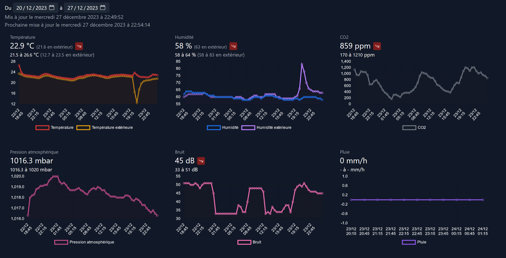
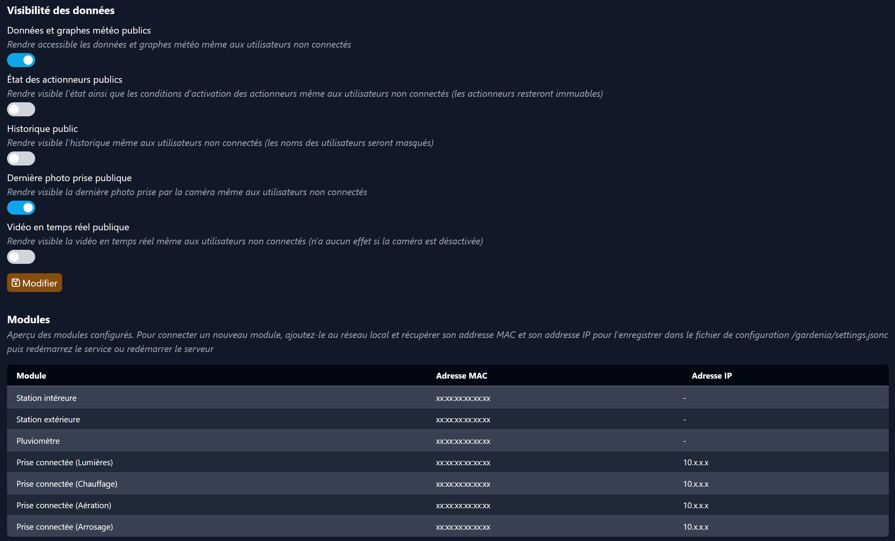
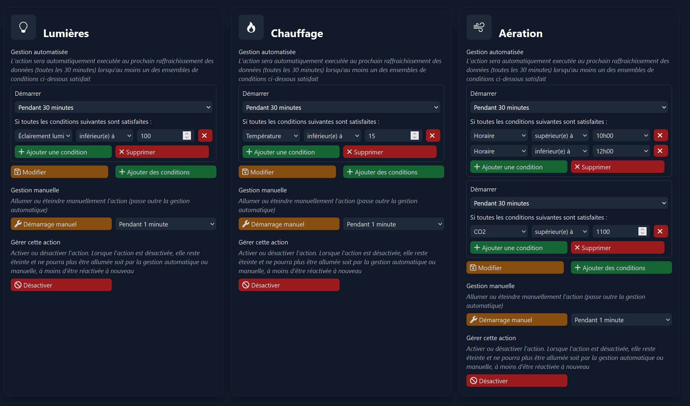
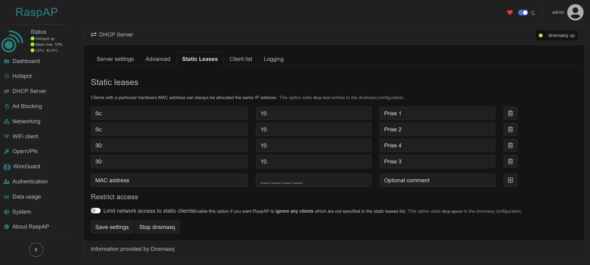

# Autonomous Garden System with Raspberry Pi
In this code, we have developed an autonomous garden system for homes to maintain humidity, weather, soil, and various features.
It is a greenhouse automation system designed to run on a Raspberry Pi. It collects data from various sensors and modules, and can automate actions such as watering, heating and taking pictures
based on conditions.

<div align="center">
  
  
  
</div>

## Web Application Screenshots

Here are some screenshots from the web application:









## Overview

This repository contains the code and documentation for an autonomous garden system developed using Raspberry Pi. The system incorporates various servos and motors to manage humidity, weather conditions, and soil health. Additionally, a web application has been created to provide convenient access and control.

## Requirements

This project is designed to run on a Raspberry Pi with:

- [Raspberry camera](https://www.raspberrypi.com/documentation/accessories/camera.html)
- [Netatmo weather station](https://dev.netatmo.com/apidocumentation) and its modules
- [TP-link Tapo P100](https://www.tp-link.com/fr/home-networking/smart-plug/tapo-p100)
- GY-302 light sensor

A TP-link Tapo account and a Netatmo account are required to u


## Installation

Use [Raspberry Pi imager](https://www.raspberrypi.com/software) to install Raspbian Lite.

Open a shell (using SSH or directly on the Pi) and run the following commands:

```sh
# Perform upgrade
apt update
apt upgrade
apt autoremove
# Set wifi country
raspi-config
# Install RaspAP (say yes to all questions, no need for the vpn client though)
mv /etc/wpa_supplicant/wpa_supplicant.conf /etc/wpa_supplicant/wpa_supplicant.conf.bak
curl -sL https://install.raspap.com | bash
# Install camera
apt install -y python3-picamera2 --no-install-recommends
# Install tapo100 support
apt install python3-pip
pip install --break-system-packages git+https://github.com/almottier/TapoP100.git@main
pip install --break-system-packages jsonc-parser
# Install deno
curl -s https://gist.githubusercontent.com/LukeChannings/09d53f5c364391042186518c8598b85e/raw/ac8cd8c675b985edd4b3e16df63ffef14d1f0e24/deno_install.sh | sh
# Clone repository
apt install -y git
git clone https://github.com/lowlighter/gardenia.git /
# Configure settings
cd /gardenia
cp settings.example.jsonc settings.jsonc
# Create service
cp gardenia.service /etc/systemd/system/gardenia.service
cp gardenia_pins.service /etc/systemd/system/gardenia_pins.service
systemctl daemon-reload
systemctl enable gardenia
systemctl start gardenia
systemctl enable gardenia_pins
systemctl start gardenia_pins
```

You should now be able to access Gardenia web interface on the configured port in `settings.jsonc`

### Installing new weather modules

It is required to configure static leases for TP-Links. Connect on the RaspAP hotspot and configure them in the `DHCP Server` section.


## Features

- 🌱 **Humidity Control**: The system is equipped to regulate humidity levels in the garden to ensure optimal conditions for plant growth.

- 🌦️ **Weather Monitoring**: It monitors weather conditions and adjusts the garden environment accordingly.

- 🌱 **Soil Health Management**: The system takes care of soil health by implementing measures for irrigation, nutrient supply, and other relevant parameters.

- ⚙️ **Servo and Motor Integration**: Various servos and motors are utilized to control physical elements within the garden setup, such as irrigation systems and adjustable covers.

- 🍓 **Raspberry Pi**: The Raspberry Pi serves as the central controller, orchestrating the different components of the autonomous garden system.

- 🌐 **Web Application**: A user-friendly web application has been developed to provide remote access and control. Users can monitor the garden's status, adjust settings, and receive real-time data.

## Setup Instructions

1. **Hardware Requirements**:
    - Raspberry Pi
    - Servos and Motors
    - Sensors for humidity and weather
    - Other relevant components

2. **Software Installation**:
    - Clone this repository to your Raspberry Pi.
    - Install the necessary dependencies outlined in the documentation.

3. **Web Application Setup**:
    - Follow the instructions in the 'web_app' directory to set up the web application on your preferred hosting environment.

4. **Configuration**:
    - Adjust configuration files as needed to match your specific hardware and environmental requirements.

5. **Run the System**:
    - Execute the main script to start the autonomous garden system.

## Usage

1. Access the web application using the provided URL.
2. Monitor the garden's status, receive real-time data, and make adjustments as needed.


# 🌐 Connect Me Through: 
<p align="left">
  <a href="https://www.facebook.com/ruban.swe.3" target="blank"></a>
  <a href="https://www.linkedin.com/in/karthik-pp-b80b38237/" target="blank"></a>
  <a href="https://www.instagram.com/ig_._karthik/" target="blank"></a>
  <a href="https://instagram.com/ig_._karthik" target="blank"></a>
  <a href="https://www.youtube.com/@KARTHIK4332" target="blank"></a>
</p>

## License

This project is licensed under the [MIT License](LICENSE), allowing for both personal and commercial use.

Feel free to explore and enhance the capabilities of this autonomous garden system! 🌿✨
